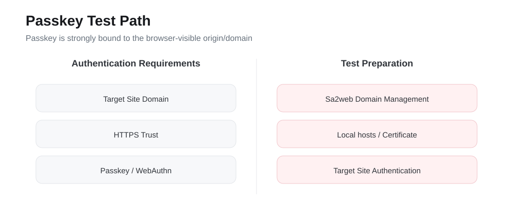

# लक्ष्य साइट्स के लिए पासकी सत्यापन सक्षम करें

## लक्ष्य

Sa2web रिमोट ब्राउज़र वातावरण में Passkey, WebAuthn, या सिक्योरिटी-की लॉगिन का उपयोग करने वाली लक्ष्य साइट्स के लिए तैयारी, ऑपरेशन फ्लो, स्थानीय परीक्षण विधि, और सत्यापन बिंदुओं की व्याख्या करें।

{#fig-passkey}

पासकी के लिए महत्वपूर्ण प्रश्न केवल यह नहीं है कि लॉगिन पेज खुल सकता है या नहीं। ब्राउज़र-दृश्यमान डोमेन, विश्वसनीय HTTPS स्थिति, और लक्ष्य-साइट प्रमाणीकरण इंटरैक्शन सभी को WebAuthn आवश्यकताओं को पूरा करना होगा।

## पूर्वापेक्षाएँ

पासकी लॉगिन का उपयोग करने से पहले, कम से कम निम्नलिखित की पुष्टि करें:

| शर्त | विवरण |
|---|---|
| लक्ष्य साइट Passkey / WebAuthn / सिक्योरिटी की का समर्थन करती है | लॉगिन पेज संबंधित प्रमाणीकरण विधि प्रदान करता है |
| उपयोगकर्ता ने लक्ष्य साइट पर पासकी बांध दी है | यदि नहीं बांधी है, तो पहले लक्ष्य साइट के अकाउंट सुरक्षा सेटिंग्स में एक जोड़ें |
| रिमोट ब्राउज़र पथ प्रमाणीकरण इंटरैक्शन का समर्थन करता है | उपयोगकर्ता ब्राउज़र प्रॉम्प्ट देख सकता है और प्रमाणीकरण क्रिया पूरी कर सकता है |
| एक्सेस डोमेन सही है | पासकी ब्राउज़र ओरिजिन से दृढ़ता से बंधी होती है और इसे मनमाने ढंग से IP या अस्थायी डोमेन से बदला नहीं जा सकता |
| HTTPS विश्वसनीय है | यदि ब्राउज़र पेज को असुरक्षित मानता है, तो WebAuthn सामान्य रूप से काम नहीं कर सकता |

::: {.callout-warning}
आधिकारिक दस्तावेज़ीकरण में कहा गया है कि पासकी वर्तमान में अभी भी अल्फा में है। कुछ साइट्स पर लॉगिन विफल हो सकता है। उत्पादन उपयोग से पहले साइट दर साइट सत्यापित करें।
:::

## बुनियादी लॉगिन फ्लो

लक्ष्य साइट कॉन्फ़िगर होने के बाद, उपयोगकर्ता इस फ्लो का पालन करते हैं:

1. प्रशासक साइट कॉन्फ़िगरेशन में URL, डोमेन, और लॉगिन फ्लो की पुष्टि करता है।
2. उपयोगकर्ता Sa2web फ्रंटएंड के माध्यम से लक्ष्य साइट में प्रवेश करता है।
3. लक्ष्य-साइट लॉगिन पेज पर, उपयोगकर्ता पासकी लॉगिन चुनता है।
4. उपयोगकर्ता ब्राउज़र प्रॉम्प्ट के अनुसार प्रमाणीकरण पूरा करता है।
5. सफल लॉगिन के बाद, पुष्टि करें कि रिमोट ब्राउज़र लक्ष्य व्यावसायिक पेज में प्रवेश करता है।

सत्यापन के दौरान, केवल यह जांच न करें कि पेज खुलता है या नहीं। यह भी पुष्टि करें कि लक्ष्य साइट वास्तव में पासकी लॉगिन विधि को पहचानती है।

## डोमेन क्यों मायने रखता है

पासकी ब्राउज़र को दृश्यमान डोमेन से दृढ़ता से बंधी होती है, अर्थात ओरिजिन। लक्ष्य-साइट पासकी लॉगिन का परीक्षण करते समय, साइट को केवल सर्वर IP या अस्थायी फ़ॉरवर्डिंग पते के माध्यम से एक्सेस न करें।

उदाहरण के लिए, मान लें कि लक्ष्य साइट वास्तव में इससे बंधी है:

```text
login.example.com
```

परीक्षण के दौरान निम्न में से किसी भी पते का उपयोग करने से विफलता हो सकती है:

```text
https://192.168.1.105/
https://temp-tunnel.example.net/
https://another-domain.example.com/
```

सही दृष्टिकोण यह है कि स्थानीय ब्राउज़र को लक्ष्य-साइट डोमेन के साथ HTTPS एक्सेस शुरू करने दें और सुनिश्चित करें कि Sa2web उस डोमेन को प्रॉक्सी किए जा सकने वाले व्यावसायिक डोमेन के रूप में पहचानता है।

## लक्ष्य-साइट पासकी के लिए स्थानीय परीक्षण

स्थानीय परीक्षण उत्पादन उपयोगकर्ताओं को अधिकृत करने से पहले पथ को मान्य करने के लिए उपयुक्त है। मुख्य लक्ष्य ब्राउज़र एड्रेस बार में ओरिजिन को लक्ष्य-साइट डोमेन के बराबर बनाना और प्रमाणपत्र को स्थानीय ब्राउज़र द्वारा विश्वसनीय बनाना है।

### लक्ष्य-साइट डोमेन जोड़ें

एडमिन कंसोल खोलें:

```text
सिस्टम सेटिंग्स > डोमेन प्रबंधन
```

**डोमेन जोड़ें** पर क्लिक करें और लक्ष्य-साइट डोमेन जोड़ें, उदाहरण के लिए:

```text
login.example.com
```

डोमेन प्रबंधन उन व्यावसायिक डोमेन को बनाए रखता है जिन्हें सिस्टम को संसाधित करने की अनुमति है। यदि डोमेन नहीं जोड़ा गया है, तो Sa2web इसे अपेक्षा के अनुरूप संसाधित नहीं कर सकता है भले ही `hosts` इसे सर्वर पर इंगित करे।

### Caddy रूट प्रमाणपत्र इंस्टॉल करें और विश्वास करें

जब इंट्रानेट या टेस्ट वातावरण Caddy आंतरिक प्रमाणपत्रों का उपयोग करता है, तो स्थानीय ब्राउज़र को संबंधित रूट प्रमाणपत्र पर भरोसा करना चाहिए। अन्यथा, Passkey / WebAuthn विफल हो सकता है क्योंकि HTTPS विश्वसनीय नहीं है।

आमतौर पर, टेस्ट कंप्यूटर पर Caddy रूट प्रमाणपत्र इंस्टॉल करें और इसे सिस्टम या ब्राउज़र में विश्वास करें। इंस्टॉलेशन विवरण के लिए आधिकारिक इंट्रानेट प्रमाणपत्र इंस्टॉलेशन दस्तावेज़ीकरण देखें।

::: {.callout-tip}
यदि आप ब्राउज़र द्वारा विश्वसनीय सार्वजनिक CA प्रमाणपत्र के साथ एक सार्वजनिक उत्पादन डोमेन का उपयोग करते हैं, तो आपको आमतौर पर मैन्युअल रूप से रूट प्रमाणपत्र इंस्टॉल करने की आवश्यकता नहीं होती है।
:::

### स्थानीय hosts संशोधित करें

स्थानीय कंप्यूटर की `hosts` फ़ाइल में, लक्ष्य-साइट डोमेन को Sa2web परिनियोजन सर्वर IP पर इंगित करें।

```text
<SERVER_IP> login.example.com
```

उदाहरण:

```text
192.168.1.105 login.example.com
```

hosts फ़ाइल स्थान:

| सिस्टम | hosts पथ |
|---|---|
| Windows | `C:\Windows\System32\drivers\etc\hosts` |
| macOS / Linux | `/etc/hosts` |

फ़ाइल संशोधित करने के बाद, ब्राउज़र को पुनः खोलें। यदि आवश्यक हो तो DNS कैश साफ़ करें ताकि ब्राउज़र पुराने रिज़ॉल्यूशन परिणाम का उपयोग न करे।

### लक्ष्य डोमेन के साथ टेस्ट पते तक पहुँचें

Sa2web द्वारा जनरेट किए गए टेस्ट पते या व्यावसायिक परिदृश्य द्वारा आवश्यक पते तक पहुँचने के लिए लक्ष्य-साइट डोमेन का उपयोग करें:

```text
https://<target-site-domain>/?saas=<...>&_d=<target-site-address>
```

पैरामीटर विवरण:

| पैरामीटर | विवरण |
|---|---|
| `<target-site-domain>` | **डोमेन प्रबंधन** में जोड़ा गया डोमेन और स्थानीय `hosts` में परिनियोजन सर्वर IP पर इंगित |
| `saas` | सिस्टम द्वारा जनरेट किया गया SaaS एक्सेस पैरामीटर या व्यावसायिक परिदृश्य द्वारा आवश्यक |
| `_d` | लक्ष्य-साइट पता, आमतौर पर वह URL जिसे खोलने की आवश्यकता है |

इन तैयारियों के बाद, ब्राउज़र एड्रेस बार में ओरिजिन लक्ष्य-साइट डोमेन है और HTTPS प्रमाणपत्र स्थानीय रूप से विश्वसनीय है। केवल तभी आपके पास लक्ष्य-साइट पासकी लॉगिन का परीक्षण करने की बुनियादी शर्तें हैं।

## परिणाम सत्यापन

परीक्षण के दौरान इस चेकलिस्ट का उपयोग करें:

- लक्ष्य-साइट लॉगिन पेज पासकी लॉगिन विधि को पहचानता है और प्रदर्शित करता है।
- उपयोगकर्ता ब्राउज़र प्रमाणीकरण प्रॉम्प्ट ट्रिगर कर सकता है।
- उपयोगकर्ता प्रमाणीकरण क्रिया पूरी कर सकता है।
- सफल लॉगिन के बाद, उपयोगकर्ता लक्ष्य व्यावसायिक पेज में प्रवेश करता है।
- यदि प्रमाणीकरण विफल होता है, तो लक्ष्य-साइट प्रॉम्प्ट और रिमोट ब्राउज़र लॉग का उपयोग समस्या निवारण के लिए किया जा सकता है।

## सामान्य विफलता कारण

| लक्षण | संभावित कारण | दिशा |
|---|---|---|
| लॉगिन पेज में पासकी एंट्री नहीं है | लक्ष्य अकाउंट ने पासकी नहीं बांधी है, या साइट ने इस विधि को सक्षम नहीं किया है | पहले लक्ष्य-साइट अकाउंट सुरक्षा सेटिंग्स में बांधें या सक्षम करें |
| पासकी क्लिक करने के बाद कुछ नहीं होता | ब्राउज़र ओरिजिन मेल नहीं खाता, या पेज विश्वसनीय HTTPS नहीं है | डोमेन, प्रमाणपत्र, और एक्सेस पता जांचें |
| वर्तमान वातावरण असमर्थित बताया जाता है | लक्ष्य साइट में सख्त WebAuthn वातावरण आवश्यकताएं हैं | लक्ष्य साइट द्वारा समर्थित ब्राउज़र कॉन्फ़िगरेशन के साथ फिर से परीक्षण करें |
| प्रमाणीकरण के बाद लॉगिन पेज पर वापस आता है | लक्ष्य-साइट सत्र स्थापित नहीं हुआ, या प्रमाणीकरण कॉलबैक इंटरसेप्ट किया गया था | लक्ष्य-साइट प्रॉम्प्ट और रिमोट ब्राउज़र लॉग जांचें |
| स्थानीय परीक्षण काम करता है, लेकिन उत्पादन उपयोगकर्ता विफल होते हैं | उपयोगकर्ता अनुमतियाँ, समूह, साइट कॉन्फ़िगरेशन, या नेटवर्क अलग हैं | टेस्ट उपयोगकर्ता और उत्पादन उपयोगकर्ता के बीच प्राधिकरण और कॉन्फ़िगरेशन की तुलना करें |

## गो-लाइव अनुशंसाएँ

पासकी में लक्ष्य साइट की अपनी नीति, ब्राउज़र वातावरण, डोमेन, और प्रमाणपत्र शामिल हैं। इसे साइट दर साइट धीरे-धीरे मान्य करें:

1. पहले प्रशासक या टेस्ट उपयोगकर्ता के साथ स्थानीय परीक्षण पूरा करें।
2. फिर सामान्य टेस्ट उपयोगकर्ता के साथ Sa2web फ्रंटएंड के माध्यम से मान्य करें।
3. पुष्टि करें कि साइट कॉन्फ़िगरेशन, डोमेन प्रबंधन, और प्रमाणपत्र स्थिर हैं।
4. व्यावसायिक उपयोगकर्ताओं के एक छोटे समूह को अधिकृत करें।
5. विफल साइट्स और विफल ब्राउज़र वातावरण एकत्र करें, और संगतता निष्कर्ष अलग से रिकॉर्ड करें।

## स्वीकृति चेकलिस्ट

- [ ] लक्ष्य साइट Passkey / WebAuthn / सिक्योरिटी की का समर्थन करती है।
- [ ] उपयोगकर्ता ने लक्ष्य साइट पर पासकी बांध दी है।
- [ ] लक्ष्य डोमेन Sa2web डोमेन प्रबंधन में जोड़ा गया है।
- [ ] स्थानीय `hosts` लक्ष्य डोमेन को Sa2web परिनियोजन सर्वर पर इंगित करता है।
- [ ] HTTPS प्रमाणपत्र स्थानीय ब्राउज़र द्वारा विश्वसनीय है।
- [ ] ब्राउज़र एड्रेस बार ओरिजिन लक्ष्य-साइट डोमेन है।
- [ ] लक्ष्य साइट पासकी प्रमाणीकरण ट्रिगर कर सकती है।
- [ ] उपयोगकर्ता प्रमाणीकरण पूरा कर सकता है और व्यावसायिक पेज में प्रवेश कर सकता है।
- [ ] जब प्रमाणीकरण विफल होता है, तो दिशा साइट प्रॉम्प्ट या रिमोट ब्राउज़र लॉग से स्थित की जा सकती है।

आधिकारिक दस्तावेज़ीकरण:

- https://www.sa2web.com/docs/en/appendix/passkey