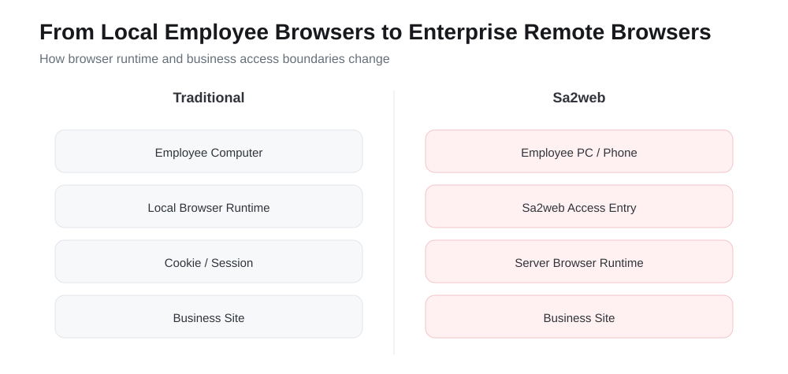

# Sa2web이란? {.unnumbered}

Sa2web은 기업 내부 시스템 및 비즈니스 애플리케이션을 위한 원격 브라우저 플랫폼입니다. "브라우저 베스천 호스트(browser bastion host)"라고도 볼 수 있습니다. 브라우저를 클라우드로 이동하는 것 이상으로, 액세스 진입점, 브라우저 런타임 환경, 계정 세션, 권한 정책, 민감한 데이터 보호, 감사 기록을 관리 가능한 워크스페이스 시스템으로 중앙화합니다.

전통적인 모델에서 직원들은 보통 로컬 브라우저에서 직접 SaaS 제품, 비즈니스 백엔드, 내부 시스템에 접근합니다. 계정, 쿠키, 세션, 페이지 데이터, 복사/다운로드 동작, 작업 흔적이 서로 다른 기기에 분산되어 있습니다. 직원이 입사, 역할 변경, 퇴사하거나 계약자, 고객, AI 에이전트에게 임시 접근 권한을 부여할 때, 관리자는 누가 무엇에 접근할 수 있는지, 어떤 신원을 사용하는지, 무엇을 볼 수 있는지, 무엇을 복사하거나 다운로드할 수 있는지, 사후에 문제를 어떻게 추적할 수 있는지 제어하기 어렵습니다. Sa2web은 이러한 브라우저 접근 거버넌스 문제를 해결하기 위해 만들어졌습니다.

Sa2web을 사용하면 사용자는 여전히 자신의 브라우저로 페이지를 열지만, 대상 사이트는 실제로 제어된 환경에 배포된 원격 브라우저에 의해 접근됩니다. 관리자는 SaaS 사이트, 내부 사이트, 워크스페이스를 통합 진입점으로 구성한 다음 그룹, 역할, 권한을 통해 다른 사용자에게 리소스를 승인할 수 있습니다. 대상 사이트 스크립트, 쿠키, 세션, 계정 환경은 원격 워크스페이스에 남아 있으므로 엔드포인트 기기는 민감한 접근 자격 증명을 장기간 보관할 필요가 없습니다.

## Sa2web으로 할 수 있는 것 {.unnumbered}

이 책은 다음 기능에 중점을 둡니다:

| 기능 | 해결되는 문제 |
|---|---|
| 클라우드 브라우저 | 직원에게 제어된 원격 브라우저 환경 제공, 로컬 기기와 분산된 데이터 간의 차이 감소 |
| SaaS 사이트 접근 | 비즈니스 또는 외부 웹사이트 시스템을 통합 진입점으로 구성, 관리자가 계정에 사전 로그인하고 직원에게 승인하여 계정 정보를 직접 넘기지 않고 사용 가능하게 함 |
| 워크스페이스 | 사이트 계정, 브라우저 구성, 접근 환경 고정; 다중 계정, 매장, 고객, 지역에 적합 |
| 내부 사이트 접근 | 직원들이 통합 진입점에서 인트라넷 시스템에 접근 가능, 엔드포인트 기기가 내부 네트워크에 직접 노출되지 않음 |
| 협업 링크 | 고객, 계약자, 임시 사용자, 배포 시나리오를 위한 제어 가능, 만료 가능, 비밀번호 보호된 접근 링크 제공 |
| 사용자, 그룹, 권한 | 그룹을 사용하여 사용자, 사이트, 워크스페이스, 내부 사이트, 프록시, 기능 권한 조합 관리 |
| 타겟 URL 보호 | 실제 타겟 URL 숨기기 또는 암호화, 오리진 주소, 내부 경로, 비즈니스 매개변수 노출 감소; 공급업체 시스템이나 기밀 유지가 필요한 시스템에 적합 |
| 워터마크 및 민감한 콘텐츠 제어 | 페이지 표시, 복사, 다운로드, 민감한 필드 중앙 제어 |
| 녹화 및 리플레이 | 감사, 문제 해결, 교육, 책임 추적을 위한 주요 접근 프로세스 기록 |
| 사이트 커스터마이징 및 스크립트 | 페이지 스크립트, 인터페이스 스크립트, 페이지 제어 규칙, 관련 도구를 사용하여 복잡한 비즈니스 페이지에 적응, 개인화된 상호작용 개선, 효율성 증대 |
| MCP / AI 접근 | Codex, Claude Code, Cursor 같은 AI 클라이언트가 권한 경계 내에서 원격 브라우저 작동 가능 |

이러한 기능들은 함께 "웹 페이지 열기"를 개인 기기 작업에서 승인, 격리, 감사, 인계가 가능한 제어된 엔터프라이즈 접근 프로세스로 전환하는 하나의 주요 흐름을 형성합니다.

## 이 책을 읽은 후 할 수 있는 것 {.unnumbered}

이 책을 읽으면 처음부터 사용 가능한 Sa2web 환경을 배포하고 일반적인 엔터프라이즈 원격 브라우저 접근 거버넌스 루프를 완료할 수 있어야 합니다:

1. Linux 서버에 Sa2web을 설치하고 라이선스, 머신, 브라우저, 인증서에 대한 기본 구성을 완료합니다.
2. 직원들이 클라우드 브라우저, SaaS 사이트, 내부 사이트, 워크스페이스에 접근할 수 있도록 합니다.
3. 워크스페이스를 사용하여 여러 비즈니스 계정과 고정된 브라우저 환경을 관리하고, 계정 혼합과 환경 드리프트를 방지합니다.
4. 협업 링크를 사용하여 임시 사용자, 계약자, 고객에게 안전하게 제한된 접근을 허용합니다.
5. 사용자, 관리자, 역할, 그룹, 권한으로 기본 승인 모델을 구축합니다.
6. 민감한 사이트에 대해 URL 보호, 워터마크, 복사/다운로드 제한, 민감한 단어 숨기기, 페이지 제어 숨기기를 활성화합니다.
7. 중요한 비즈니스 접근에 대해 녹화 및 리플레이를 활성화하여 검토 가능한 작업 증거를 생성합니다.
8. 복잡한 사이트에 대한 스크립트를 작성하여 페이지 향상, 인터페이스 처리, 데이터 마스킹, 자동화 지원.
9. Sa2web MCP를 구성하여 AI 에이전트가 제어된 계정과 승인된 범위를 통해 비즈니스 페이지에 접근할 수 있도록 합니다.
10. 일반적인 배포, 접근, 인증서, 권한, MCP, 패스키 문제 해결.

즉, 이 책의 목표는 단순히 "성공적으로 설치"를 돕는 것이 아닙니다. 실제 팀 사용에 적합한, 제공 가능하고, 관리 가능하고, 진단 가능하며, 엔터프라이즈 원격 브라우저 접근 솔루션 구축을 돕는 것입니다.

# 이 책의 사용 방법 {.unnumbered}

이는 일반적으로 Sa2web을 사용하는 순서대로 구성된 실습 튜토리얼입니다.

처음 Sa2web을 사용하는 경우 파트 1을 순서대로 완료하세요:

1. Sa2web 배포.
2. 머신 및 브라우저 생성.
3. SaaS 사이트 접근 설정.
4. 협업 링크 생성.
5. 워크스페이스를 사용하여 다중 계정 관리.
6. 내부 사이트 연결.
7. 그룹, 역할, 권한으로 접근 승인.

그 후 타겟 URL 보호, 워터마크, 녹화 및 리플레이, MCP, 사이트 커스터마이징 같은 고급 기능으로 넘어갑니다.

{#fig-overview}

::: {.callout-note}
이 책은 [공식 Sa2web 중국어 문서](https://www.sa2web.com/docs/en/)를 주요 사실 소스로 사용한 다음, 제로에서 시작하는 실용적인 경로를 중심으로 자료를 재구성했습니다. 제품이 변경되면 항상 공식 문서와 사용 중인 버전의 실제 UI를 따르세요.
:::

# 처음 알아야 할 6가지 객체 {.unnumbered}

| 객체 | 역할 |
|---|---|
| 사용자 | 사용자 프론트엔드에 로그인하여 사이트, 워크스페이스, 내부 사이트 접근 |
| 머신 | 원격 브라우저 런타임 환경 호스트 |
| 브라우저 인스턴스 | 실제로 SaaS 또는 내부 사이트에 접근하는 브라우저 런타임 |
| SaaS 사이트 | 사용자에게 노출되는 외부 비즈니스 사이트 |
| 내부 사이트 | 기업 내부 시스템으로의 진입점 |
| 워크스페이스 | 사이트 계정, 브라우저 환경, 구성을 고정하는 접근 진입점 |

실제 엔터프라이즈 승인에서 **그룹**은 보통 사용자, 사이트, 워크스페이스, 내부 사이트, 에이전트, 권한을 결합합니다.

공식 문서:

- https://www.sa2web.com/docs/en/concepts