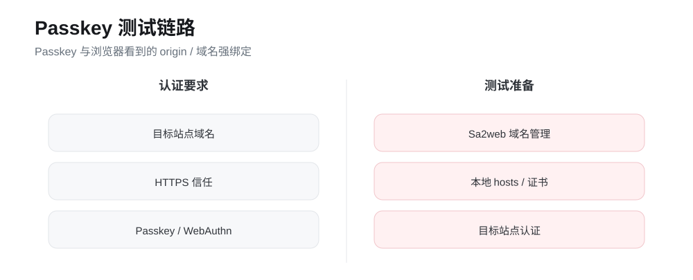

# 开启目标站点 Passkey 验证

## 目标

说明目标站点使用 Passkey、WebAuthn 或安全密钥登录时，在 Sa2web 远程浏览器环境中的准备事项、操作流程、本地测试方式和验证要点。

{#fig-passkey}

Passkey 的关键点不是“能不能打开登录页”，而是浏览器看到的域名、HTTPS 可信状态和目标站点的认证交互是否都满足 WebAuthn 要求。

## 前置条件

使用 Passkey 登录前，至少确认：

| 条件 | 说明 |
|---|---|
| 目标站点支持 Passkey / WebAuthn / 安全密钥 | 登录页能选择对应认证方式 |
| 用户已在目标站点绑定 Passkey | 未绑定时通常需要先在目标站点账号安全设置中添加 |
| 远程浏览器链路支持认证交互 | 用户能看到浏览器提示，并能完成认证动作 |
| 访问域名正确 | Passkey 与浏览器 origin 强绑定，不能随意换成 IP 或临时域名 |
| HTTPS 被信任 | 浏览器认为页面不安全时，WebAuthn 可能无法正常工作 |

::: {.callout-warning}
官方文档说明 Passkey 当前仍为 alpha 阶段，部分站点可能会登录失败。生产使用前必须按站点逐一验证。
:::

## 基本登录流程

当目标站点已经配置完成，用户按以下流程使用：

1. 管理员在站点配置中确认 URL、域名和登录流程正确；
2. 用户通过 Sa2web 前端进入目标站点；
3. 在目标站点登录页选择 Passkey 登录；
4. 按浏览器提示完成认证；
5. 登录成功后，确认远程浏览器进入目标业务页面。

验证时不要只看“页面是否打开”，还要确认目标站点是否真正识别了 Passkey 登录方式。

## 为什么域名很重要

Passkey 与浏览器看到的域名，也就是 origin，强绑定。测试目标站点 Passkey 登录时，不能只通过服务器 IP 或临时转发地址访问。

例如目标站点实际绑定的是：

```text
login.example.com
```

如果测试时用下面这些地址访问，就可能触发失败：

```text
https://192.168.1.105/
https://temp-tunnel.example.net/
https://another-domain.example.com/
```

正确做法是让本地浏览器以目标站点域名发起 HTTPS 访问，并让该域名被 Sa2web 识别为可代理的业务域名。

## 目标站点 Passkey 本地测试

本地测试适合在正式授权用户前验证链路。核心目标是让浏览器地址栏里的 origin 等于目标站点域名，并且证书被本地浏览器信任。

### 添加目标站点域名

进入管理平台：

```text
系统设置 > 域名管理
```

点击 **添加域名**，添加目标站点域名，例如：

```text
login.example.com
```

域名管理用于维护允许系统处理的业务域名。没有添加的域名，即使 hosts 指向了服务器，也不一定能被 Sa2web 按预期处理。

### 安装并信任 Caddy 根证书

内网或测试环境使用 Caddy 内部证书时，本地浏览器必须信任对应根证书，否则 Passkey / WebAuthn 可能因为 HTTPS 不可信而无法完成认证。

通常需要在测试电脑上安装 Caddy 根证书，并让系统或浏览器信任它。内网证书安装方式见官方“内网证书安装”文档。

::: {.callout-tip}
如果是公网正式域名，并使用浏览器已信任的公开 CA 证书，通常不需要手动安装根证书。
:::

### 修改本地 hosts

在本地电脑的 `hosts` 文件中，把目标站点域名指向 Sa2web 部署服务器 IP。

```text
<SERVER_IP> login.example.com
```

示例：

```text
192.168.1.105 login.example.com
```

不同系统的 hosts 文件位置：

| 系统 | hosts 路径 |
|---|---|
| Windows | `C:\Windows\System32\drivers\etc\hosts` |
| macOS / Linux | `/etc/hosts` |

修改后建议重新打开浏览器。必要时清理 DNS 缓存，避免浏览器继续使用旧解析结果。

### 使用目标域名访问测试地址

使用目标站点域名访问 Sa2web 生成或业务场景需要的测试地址：

```text
https://<目标站点域名>/?saas=<...>&_d=<目标站点地址>
```

参数说明：

| 参数 | 说明 |
|---|---|
| `<目标站点域名>` | 已在“域名管理”中添加，并已在本地 hosts 指向部署服务器 IP 的域名 |
| `saas` | 系统生成或业务场景需要携带的 SaaS 访问参数 |
| `_d` | 目标站点地址，通常为需要实际打开的目标站点 URL |

完成以上准备后，浏览器地址栏中的 origin 会是目标站点域名，并且 HTTPS 证书被本地信任，才具备进行目标站点 Passkey 登录测试的基础条件。

## 结果验证

测试时按下面的清单确认：

- 目标站点登录页能识别并展示 Passkey 登录方式；
- 用户能触发浏览器认证提示；
- 用户能完成认证动作；
- 登录成功后进入目标业务页面；
- 认证失败时，目标站点提示和远程浏览器日志可用于排查。

## 常见失败原因

| 现象 | 可能原因 | 处理方向 |
|---|---|---|
| 登录页没有 Passkey 入口 | 目标账号未绑定 Passkey，或站点未开放该方式 | 先在目标站点账号安全设置中绑定或启用 |
| 点击 Passkey 后无反应 | 浏览器 origin 不匹配，或页面不是可信 HTTPS | 检查域名、证书和访问地址 |
| 提示当前环境不支持 | 目标站点对 WebAuthn 环境要求更严格 | 换目标站点支持的浏览器配置后再测 |
| 认证后仍回到登录页 | 目标站点会话未建立，或认证回调被拦截 | 查看目标站点提示和远程浏览器日志 |
| 本地测试可以，正式用户失败 | 用户权限、分组、站点配置或网络不同 | 对比测试用户和正式用户的授权与配置 |

## 上线建议

Passkey 涉及目标站点自身策略、浏览器环境、域名和证书，建议按站点灰度验证：

1. 先用管理员或测试用户完成本地测试；
2. 再用普通测试用户通过 Sa2web 前端验证；
3. 确认站点配置、域名管理和证书都稳定；
4. 小范围授权业务用户；
5. 收集失败站点和失败浏览器环境，单独记录兼容性结论。

## 验收

- [ ] 目标站点支持 Passkey / WebAuthn / 安全密钥；
- [ ] 用户已在目标站点绑定 Passkey；
- [ ] 目标域名已加入 Sa2web 域名管理；
- [ ] 本地 hosts 已把目标域名指向 Sa2web 部署服务器；
- [ ] HTTPS 证书被本地浏览器信任；
- [ ] 浏览器地址栏 origin 是目标站点域名；
- [ ] 目标站点能触发 Passkey 认证；
- [ ] 用户能完成认证并进入业务页面；
- [ ] 认证失败时能从站点提示或远程浏览器日志定位方向。

官方文档：

- https://www.sa2web.com/docs/zh/appendix/passkey
