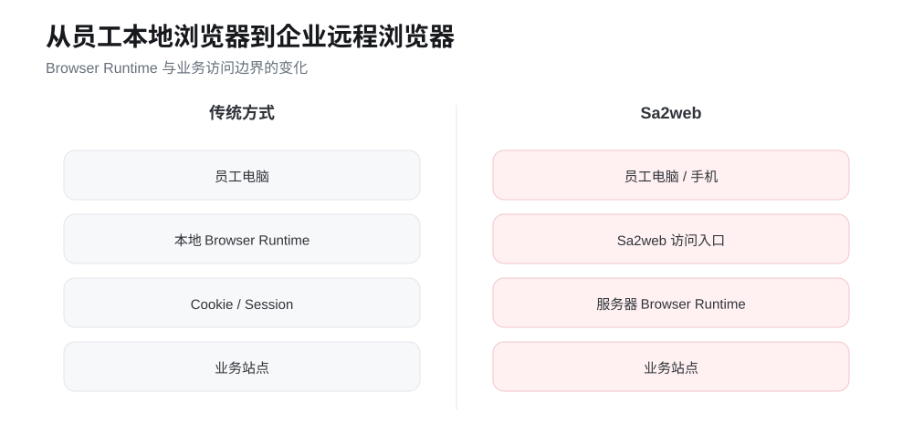

# Sa2web 是什么 {.unnumbered}

Sa2web 是一个面向企业内部系统和业务应用的远程浏览器平台，也可以理解为“浏览器堡垒”。它不是简单把浏览器搬到云端，而是把访问入口、浏览器运行环境、账号会话、权限策略、敏感数据保护和审计记录集中到一套可管理的工作空间里。

在传统模式下，员工通常直接用本地浏览器访问 SaaS、业务后台或内部系统。账号、Cookie、会话、页面数据、复制下载行为和操作痕迹会分散在不同设备上；当员工入职、转岗、离职，或临时给外包、客户、AI Agent 开放访问时，管理员很难统一控制“谁能访问什么、用什么身份访问、能看到什么、能复制下载什么、出了问题如何追溯”。Sa2web 要解决的正是这类浏览器访问治理问题。

使用 Sa2web 后，用户仍然通过自己的浏览器打开页面，但真正访问目标站点的是部署在受控环境中的远程浏览器。管理员可以把 SaaS 站点、内部站点和工作空间配置成统一入口，再通过分组、角色和权限把资源授权给不同用户。目标站点的脚本、Cookie、会话和账号环境保留在远程工作空间中，终端设备不需要长期保存敏感访问凭据。

## Sa2web 能做什么 {.unnumbered}

本书围绕以下能力展开：

| 能力 | 解决的问题 |
|---|---|
| 云浏览器 | 为企业员工提供受控的远程浏览器环境，减少本地设备环境差异和数据散落 |
| SaaS 站点访问 | 把业务或者外部网站系统配置成统一入口，支持管理员预登录账号后授权企业员工使用,而不用将帐号等信息直接交给员工 |
| 工作空间 | 固定站点账号、浏览器配置和访问环境，适合多账号、多店铺、多客户、多地区场景 |
| 内部站点访问 | 让员工从统一入口访问内网系统，终端设备不必直接暴露在内部网络中 |
| 协作链接 | 为客户、外包、临时人员或交付场景提供可控、可过期、可加密码的访问链接 |
| 用户、分组与权限 | 用分组把用户、站点、工作空间、内部站点、代理和功能权限组合起来管理 |
| 目标地址保护 | 隐藏或加密真实目标 URL，减少源站地址、内部路径和业务参数暴露,适合供用商系统，或者需要保密的系统 |
| 水印与敏感内容控制 | 对页面显示、复制、下载和敏感字段做集中策略控制 |
| 录制与回放 | 记录关键访问过程，便于审计、排查、培训和责任追溯 |
| 站点定制与脚本 | 用页面脚本、接口脚本、页面控件控制等方式适配复杂业务页面, 方便让外部系统提供更好的个性化交互和增效 |
| MCP / AI 访问 | 让 Codex、Claude Code、Cursor 等 AI 客户端在权限边界内操作远程浏览器 |

这些能力共同形成一条主线：把“打开网页”这件事从个人设备行为，变成企业可授权、可隔离、可审计、可交接的受控访问流程。

## 学完整本书后能做什么 {.unnumbered}

学完整本书，你应该能够从零部署一套可用的 Sa2web 环境，并完成一条企业内部常见的访问治理闭环：

1. 在 Linux 服务器上安装 Sa2web，并完成许可证、机器、浏览器和证书等基础配置；
2. 给员工开通云浏览器、SaaS 站点、内部站点和工作空间访问；
3. 用工作空间管理多个业务账号和固定浏览器环境，避免账号混用和环境漂移；
4. 用协作链接安全地向临时用户、外包人员或客户开放有限访问；
5. 用用户、管理员、角色、分组和权限建立基本授权模型；
6. 对敏感站点启用 URL 保护、水印、复制下载限制、敏感词隐藏和页面控件隐藏；
7. 对关键业务访问启用录制回放，形成可检查的操作证据；
8. 为复杂站点编写脚本，做页面增强、接口处理、数据遮蔽或自动化辅助；
9. 配置 Sa2web MCP，让 AI Agent 在受控账号和授权范围内访问业务页面；
10. 处理常见部署、访问、证书、权限、MCP 和 Passkey 问题。

换句话说，本书的目标不是只让你“安装成功”，而是让你能搭出一套可交付、可管理、可排查、适合团队实际使用的企业远程浏览器访问方案。

# 如何使用本书 {.unnumbered}

这是一份按真实使用顺序组织的实战教程。

第一次使用 Sa2web，建议按顺序完成 Part 1：

1. 部署 Sa2web；
2. 创建机器与浏览器；
3. 建立 SaaS 站点访问；
4. 创建协作链接；
5. 用 工作空间 管理多账户；
6. 接入内部站点；
7. 用分组、角色和权限完成授权。

完成后再进入目标地址保护、水印、录制回放、MCP、站点定制等进阶能力。

{#fig-overview}

::: {.callout-note}
本书以 [Sa2web 官方中文文档](https://www.sa2web.com/docs/zh/) 为主要事实来源，并按“从零开始真正用起来”的顺序重新组织。产品版本变化时，以对应版本官方文档和实际界面为准。
:::

# 先认识 6 个对象 {.unnumbered}

| 对象 | 作用 |
|---|---|
| 用户 | 登录用户前端，访问站点、工作空间和内部站点 |
| 机器 | 承载远程浏览器运行环境 |
| 浏览器实例 | 真正访问 SaaS / 内部站点的 浏览器运行环境 |
| SaaS 站点 | 面向用户访问的外部业务站点 |
| 内部站点 | 企业内部系统入口 |
| 工作空间 | 固定站点账号、浏览器环境和配置的访问入口 |

实际企业授权通常通过 **分组** 统一组合用户、站点、工作空间、内部站点、代理和权限。

官方文档：

- https://www.sa2web.com/docs/zh/concepts
